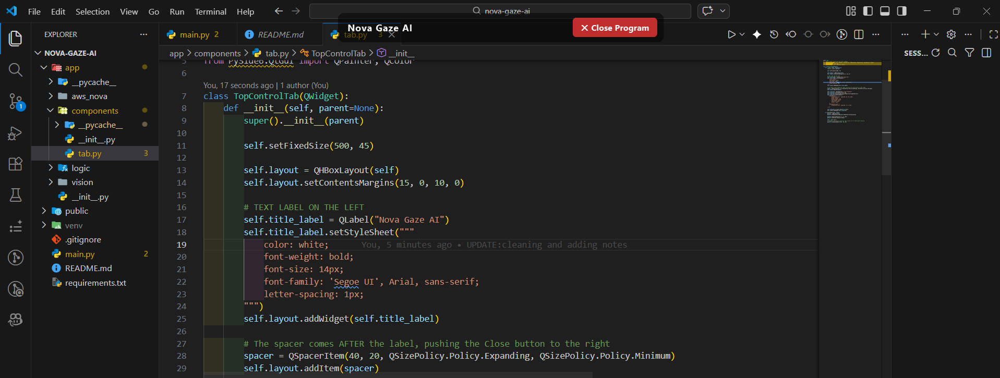

<div align="center">

# 👁️ Nova Gaze AI
**AI-Powered Eye Tracking for Autonomous Screen Navigation**

*Empowering individuals with ALS and severe paralysis to control their computers autonomously using only their eyes.*

</div>

## 📖 About the Project
For individuals with Amyotrophic Lateral Sclerosis (ALS) or severe motor disabilities, traditional computer navigation is often impossible. <br>
**Nova Gaze AI** bridges this gap by using a standard webcam and AI to track eye movements and translate them into direct screen interactions. <br>
Instead of relying on expensive, specialized hardware, this application acts as a transparent, always-on-top layer on your desktop. It allows users to navigate interfaces, click buttons, and browse the web autonomously using intuitive eye gestures.

---

## 🚀 Getting Started
Follow these instructions to set up the project and run it on your local machine for development and testing.

### Prerequisites
Make sure you have the following installed on your machine:

---
### Installation & Setup
**1. Clone the repository**

Open your terminal and run the following command to clone the project to your local machine:

```bash
git clone https://github.com/JohnLloydCanoy/nova-gaze-ai.git

cd amuma-ai

```
---

**2. Install venv**

```bash
python -m venv venv
```

---

**3. Activate the Virtual Environment**

Before installing any packages (like pip install requests),it need to turn the environment on.
```bash
.\venv\Scripts\activate
```

---

**4. Install Requirmentst**

```bash
pip install -r requirements.txt
```

---


**4.Running the program**

```bash
python main.py
```
Or


```bash
py main.py
```
---

**5. Expected Outcome**



---

### UPDATE LOCAL REPOSITORY 
**1. Pull**
 
```bash
git pull origin main
```

**1. Create a branch for a specific feature**
create a isolated branch for the a specific feature to be added 